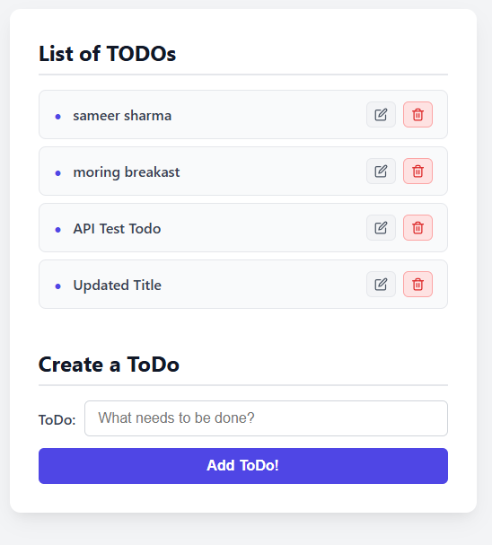
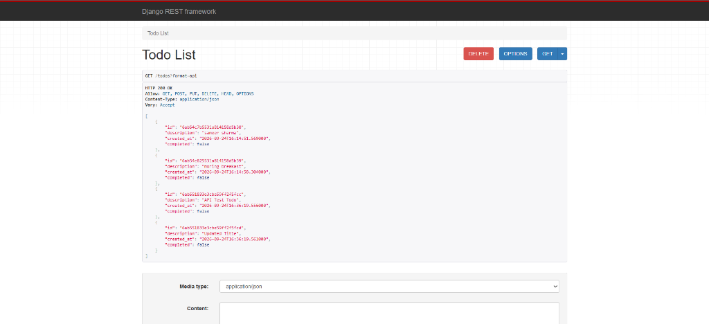

# Full-Stack TODO Application (Adbrew Technical Assignment)

A production-grade, containerized full-stack application built with **React** (Pure React Hooks), **Django REST Framework**, and **MongoDB**, orchestrated with **Docker Compose**.

---

## 📸 Screenshots

| React Frontend (`http://localhost:3000`) | Django REST API (`http://localhost:8000/todos`) |
| :---: | :---: |
|  |  |

---

## 🏗️ Architecture & Software Design Principles

This project was built adhering strictly to **SOLID Principles**, the **Repository Pattern**, and **Separation of Concerns**:

### 1. Backend Layered Architecture (`src/rest/rest/`)
- **Data Access Layer (`repository.py`)**:
  - Implements `TodoRepositoryInterface` (Abstract Base Class) following the **Dependency Inversion Principle (DIP)**.
  - `MongoTodoRepository` encapsulates all direct MongoDB operations via `pymongo` (handling document insertion, sorting, updates, deletions, and `ObjectId` serialization).
  - **No Django Models, ORM, Serializers, or SQLite DB** were used, as strictly required by the assignment guidelines.
- **Business Logic Layer (`services.py`)**:
  - `TodoService` follows the **Single Responsibility Principle (SRP)** by managing business logic, trimming inputs, and validating data (rejecting empty descriptions, enforcing length constraints).
  - Uses dependency injection to receive any storage implementation satisfying `TodoRepositoryInterface`.
- **API Presentation Layer (`views.py`)**:
  - `TodoListView` (inheriting from DRF `APIView`) handles HTTP request/response serialization, returning standard HTTP status codes (`200 OK`, `201 Created`, `400 Bad Request`, `500 Internal Server Error`).
- **RESTful Routing (`urls.py`)**:
  - Supports both trailing and non-trailing slash routes: `/todos/` and `/todos/<id>/`.

### 2. Frontend Architecture (`src/app/src/`)
- **Pure React Hooks**:
  - Zero traditional class components or deprecated lifecycle methods.
  - Implemented entirely with modern functional components and hooks (`useState`, `useEffect`, `useCallback`).
- **Custom Hook (`hooks/useTodos.js`)**:
  - Encapsulates state management (`todos`, `loading`, `error`, `submitting`, `submitError`), optimistic updates, and lifecycle fetching.
- **API Service Layer (`api/todoApi.js`)**:
  - Isolates HTTP `fetch` requests (`getTodos`, `createTodo`, `updateTodo`, `deleteTodo`) from UI components.
- **Modular Components**:
  - `TodoList`: Renders the collection with loading skeletons, error/retry banners, and empty states.
  - `TodoItem`: Handles individual items with inline editing (`Save` / `Cancel`) and red deletion button.
  - `TodoForm`: Controlled input form with client-side validation, accessible labels (`htmlFor`), and disabled states during network operations.

---

## 🛠️ Docker Setup & Debugging Walkthrough

The original setup had intentional environmental challenges that were diagnosed and resolved:

1. **Debian Buster Archive Repositories**:
   - The default `python:3.8` Docker Hub image moved to Debian Bookworm, which breaks MongoDB 4.4 due to `libssl1.1` removal.
   - Pinning to `python:3.8-buster` solved the OpenSSL dependency, but Debian Buster reached End-Of-Life (EOL), causing `deb.debian.org` to return 404s.
   - **Resolution**: Updated `Dockerfile` to pull from `archive.debian.org`.
2. **Node.js & Yarn Toolchain (Multi-Stage Build)**:
   - The original image ran `apt-get install yarn` without installing `nodejs`. In Debian, Yarn requires a Node runtime; without it, `yarn install` fails immediately.
   - **Resolution**: Implemented a multi-stage Docker build copying Node 16 LTS and Yarn directly from `node:16-buster-slim`, eliminating unstable apt network downloads.
3. **Cross-Platform Volume Mounts & File Polling**:
   - Configured `.env` with `ADBREW_CODEBASE_PATH=./src` for cross-platform portability.
   - Added `CHOKIDAR_USEPOLLING=true` and `WATCHPACK_POLLING=true` to `docker-compose.yml` to ensure file edits made on Windows hosts reliably trigger live hot-reloading inside the container.

---

## 🚀 Quickstart: Running on Local

### Prerequisites
- [Docker Desktop](https://www.docker.com/products/docker-desktop/) installed and running.

### 1. Start the Containers
Open PowerShell or your terminal in the project directory:

```bash
docker-compose up -d
```

### 2. Access the Application
- **Frontend React App**: [http://localhost:3000](http://localhost:3000)
- **Django REST API**: [http://localhost:8000/todos](http://localhost:8000/todos)
- **MongoDB**: Port `27017`

### 3. Check Running Containers
```bash
docker ps
```
You should see 3 containers running:
- `api` (Django on `0.0.0.0:8000`)
- `app` (React dev server on `0.0.0.0:3000`)
- `mongo` (MongoDB on `0.0.0.0:27017`)

### 4. Stop the Containers
```bash
docker-compose down
```

---

## 📡 API Endpoints

| Method | Endpoint | Description | Status Codes |
| :--- | :--- | :--- | :--- |
| **GET** | `/todos/` | Retrieve all TODOs sorted by creation date | `200 OK`, `500 Internal Error` |
| **POST** | `/todos/` | Create a new TODO item (`{"description": "..."}`) | `201 Created`, `400 Bad Request` |
| **PUT** | `/todos/<id>/` | Update an existing TODO item description | `200 OK`, `400 Bad Request`, `404 Not Found` |
| **DELETE** | `/todos/<id>/` | Delete a TODO item from MongoDB | `200 OK`, `404 Not Found` |

---

## 🧪 Running Automated Tests

### Backend Tests (Django)
Runs all unit and API integration tests inside the `api` container:
```bash
docker exec -w /src/rest api python manage.py test rest
```
*Result: 12 tests passed.*

### Frontend Tests (React Jest)
Runs the React Testing Library suite inside the `app` container:
```bash
docker exec -e CI=true -w /src/app app yarn test --runInBand
```
*Result: 3 test suites passed.*
